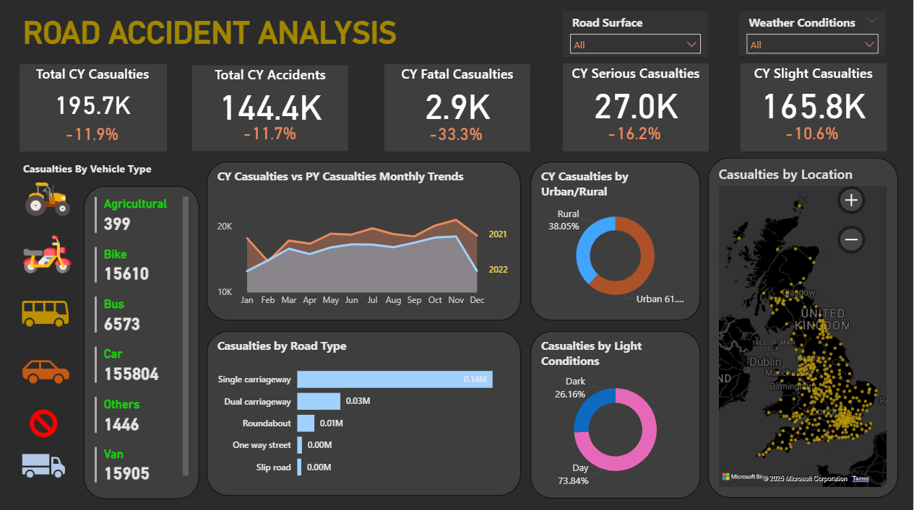

# 🚗 **Road Accident Analysis Dashboard (Power BI)**  

A **Power BI dashboard** designed to analyze and visualize **car accident data** to identify patterns, high-risk zones, and contributing factors.  

This dashboard helps authorities and analysts make **data-driven decisions** for improving **road safety**, **reducing accident frequency**, and **saving lives**.  

## 🖼️ **Dashboard Preview**

  

*(Preview of the Power BI dashboard visualizing key road safety insights.)*  

## 📊 **Dashboard Overview**

The dashboard includes the following insights:

- 🚦 **Total Accidents Overview** — Total number of accidents and year-over-year comparison  
- 📅 **Accidents by Time & Day** — Identifies when most accidents occur (peak hours, weekdays, weekends)  
- 📍 **Location Analysis** — Highlights accident-prone areas and high-risk zones  
- ⚠️ **Severity Distribution** — Shows accident severity (minor, serious, fatal)  
- 🚗 **Vehicle Type Breakdown** — Analyzes types of vehicles involved in accidents  
- 🌦️ **Weather Impact** — Examines how weather conditions affect accident rates  
- 🧾 **Trend Analysis** — Monthly or yearly accident trends  

## 🎯 **Key Benefits**

- Identify accident hotspots and risk-prone regions  
- Analyze accident patterns by **time, weather, and vehicle type**  
- Track accident trends over time for better decision-making  
- Improve traffic safety planning and awareness campaigns  

## 🧠 **Tools & Technologies**

- **Power BI Desktop** – Dashboard creation and visualization  
- **Excel / CSV Data Source** – Input data format  
- **DAX Measures** – For dynamic calculations and KPIs  

